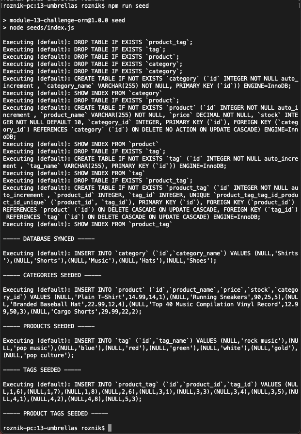
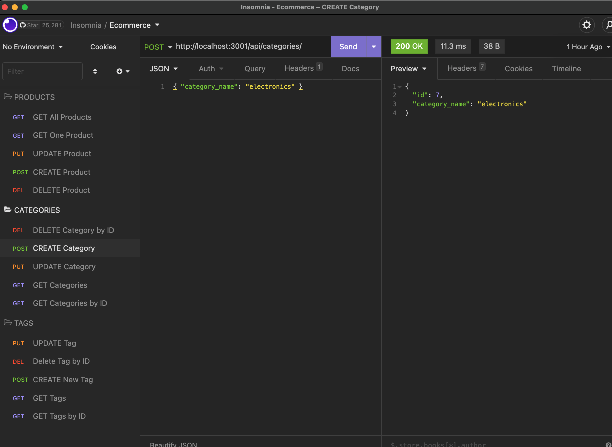
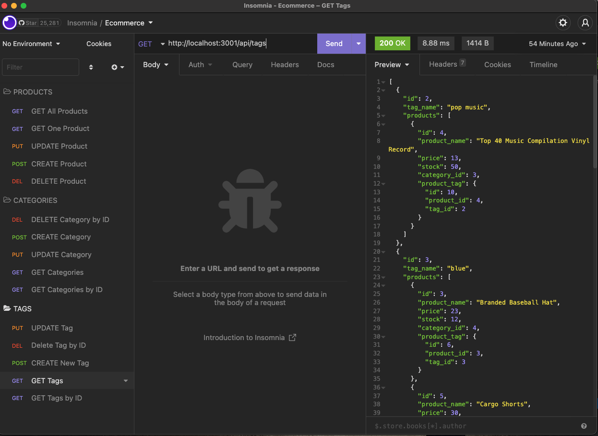
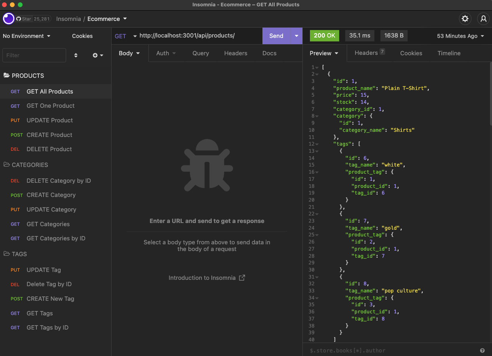

# Object-Relational Mapping (ORM) Challenge: E-commerce Back End

## Description

This project is to build the back end for an online commerce store. I used the Express.js API and with Sequelize to interact with a MySQL database.

## User Story
```
AS A manager at an internet retail company
I WANT a back end for my e-commerce website that uses the latest technologies
SO THAT my company can compete with other e-commerce companies
```

## Acceptance Criteria
```
GIVEN a functional Express.js API
WHEN I add my database name, MySQL username, and MySQL password to an environment variable file
THEN I am able to connect to a database using Sequelize
WHEN I enter schema and seed commands
THEN a development database is created and is seeded with test data
WHEN I enter the command to invoke the application
THEN my server is started and the Sequelize models are synced to the MySQL database
WHEN I open API GET routes in Insomnia for categories, products, or tags
THEN the data for each of these routes is displayed in a formatted JSON
WHEN I test API POST, PUT, and DELETE routes in Insomnia
THEN I am able to successfully create, update, and delete data in my database
```

## Installation

Clone the project with:
```
git clone git@github.com:n-roz/13-fantastic-umbrellas.git
```

Then:

```npm init```

```npm install mysql2 sequelize dotenv```

## Usage

To open a MySQL shell, run the following command in your root folder:
```
mysql -u root -p
```

Enter your MySQL password when prompted. This can be edited in ```.env```. Technically, you should have to make your own ```.env``` file. ```.env``` is included in my ```.gitignore```, but for some reason it is still on my GitHub repository.

```
source db/schema.sql;
```

```
quit;
```

```
npm run seed
```



To invoke the application:
```
npm start
```

## Insomnia

Categories
```
GET - GET Categories http://localhost:3001/api/categories/
GET - GET Categories By ID http://localhost:3001/api/categories/:id
PUT - UPDATE Categories http://localhost:3001/api/categories/:id
POST - CREATE Category http://localhost:3001/api/categories/
DEL - DELETE Category By ID http://localhost:3001/api/categories/:id
```


Tags
```
POST - CREATE New Tag http://localhost:3001/api/tags
GET - GET Tags http://localhost:3001/api/tags
GET - GET Tags By ID http://localhost:3001/api/tags/:id
PUT - UPDATE Tag http://localhost:3001/api/tags/:id
DEL - DELETE Tag By ID http://localhost:3001/api/tags/:id
```


Products
```
GET - GET All Products http://localhost:3001/api/products/
GET - GET One Product http://localhost:3001/api/products/:id
PUT - UPDATE Product http://localhost:3001/api/products/:id
POST - CREATE Product http://localhost:3001/api/products/
DEL - DELETE Product http://localhost:3001/api/products/:id
```


## Contributors and Questions

Special thanks to AskBCS and my tutor Melanie Blower.